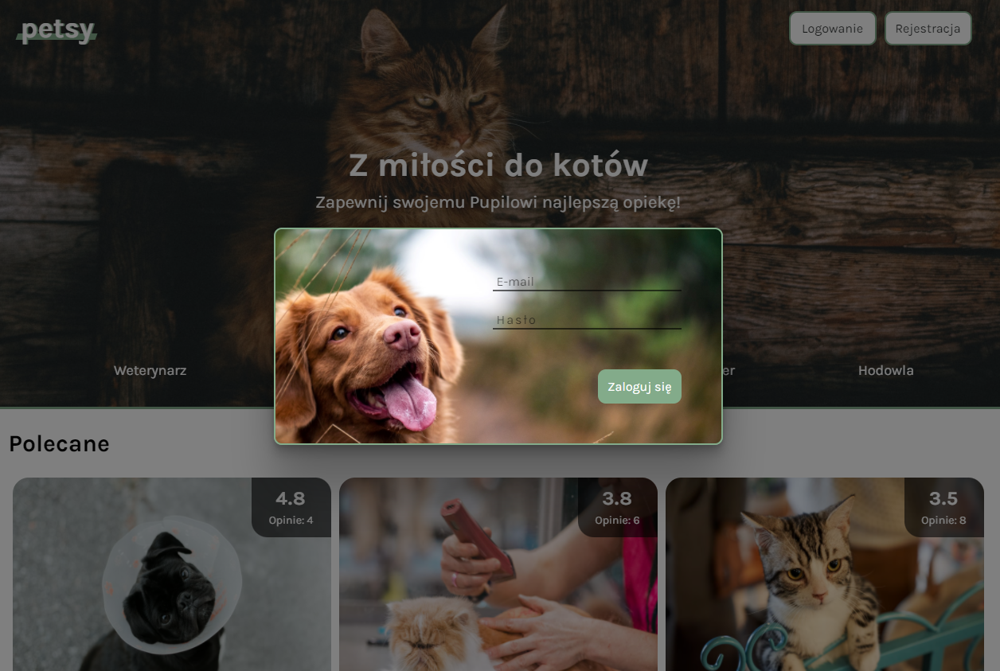
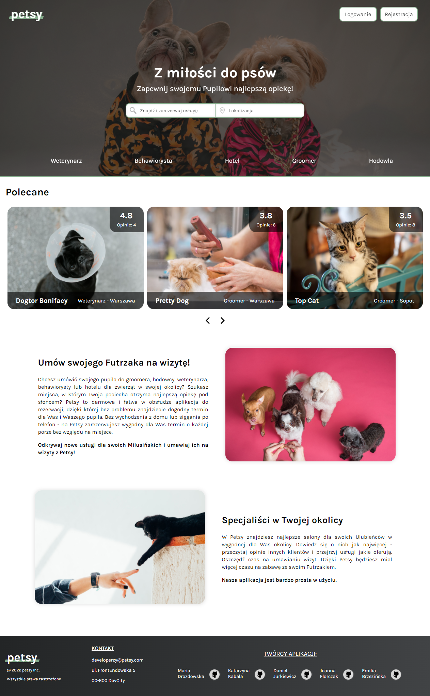
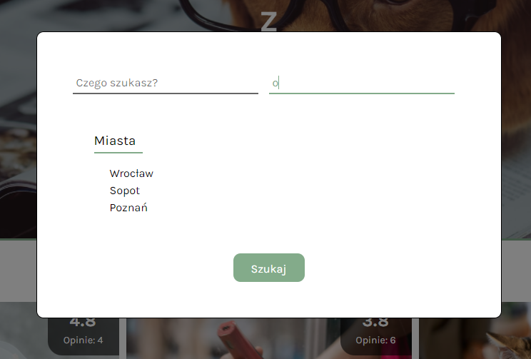
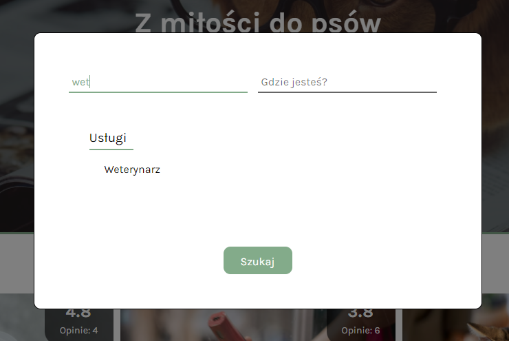
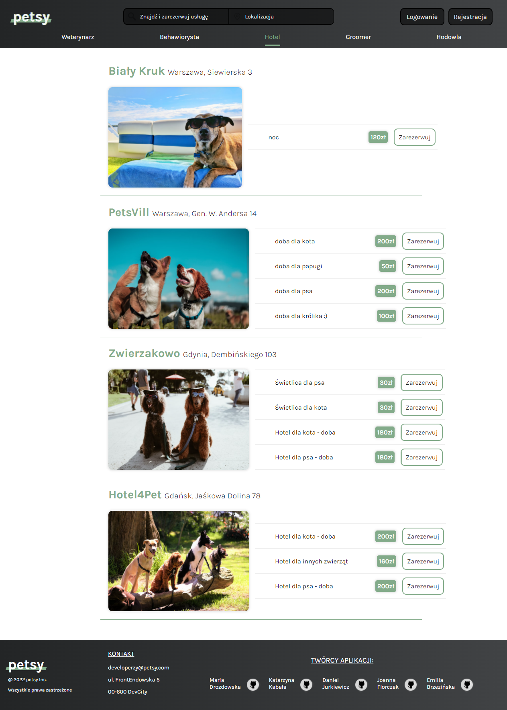
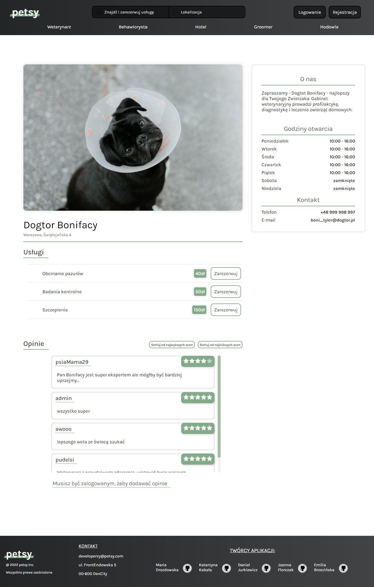
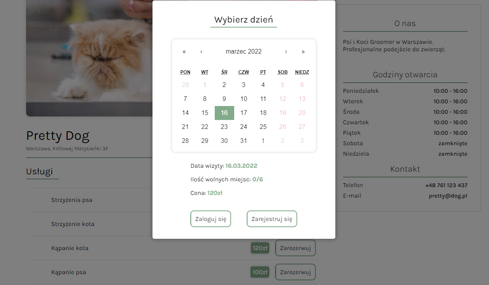

# Petsy

Petsy is an appointment reservation application for pet owners and their pupils. [Check it out!](https://petsy-83eb2.web.app/)

Read only access is available to all users, but if you would like to book a visit or add an opinion you will be asked to log in.
In order to log in please use the navigation buttons found in the top right corner.

## Technology

-   React (with React Router and CSS Modules)
-   NPM Packages (Calendar and Slider components)
-   Firebase

## Methodology

The application was designed and developed from scratch during the final two weeks of infoShare Academy front-end bootcamp, divided into two one-week-long Sprints using the Scrum methodology and Jira project management tool.

Our MVP (Minimal Viable Product) included service browsing with interactive search bar working across various filters and categories, reservation and reservation management capabilities for registered users, and the ability to rate and post comments by registered users, all of which were to be delivered in a visually pleasing and inviting form.

We have effectively achieved our MVP while performing daily stand-ups with relevant updates on our individual and collective progress.

## Views

### Home View

Home View includes:

-   Interactive search bar,
-   Recommended section displaying top-5 of the highest rated service providers registered in our database, filtered in real time based on user-provided opinions.
-   Informational section.
-   Footer with contact information and GitHub links for project creators.

After navigating to the search bar you can browse available options and services by their city location, service category or a specific business name.

### Category View

After you searched business per category or city you will go to Category View with list of businesses according to your preferences.
In this step you can check the service and book a date.

### Product View

Product View includes more information about specific service providers with their contact information, specific services on offer as well as a comments and opinions sections for registered users.

### Reservations

In order to effectively achieve our MVP, we have decided to utilize the React Calendar component.

Any reservations made by a registered user can be managed via their reservation list page.

More about [React Calendar](https://www.npmjs.com/package/react-calendar).

#

## Our Team

[Emilia Brzezińska](https://github.com/emiliabrzezinska)

[Maria Drozdowska](https://github.com/drozdowska-maria)

[Daniel Jurkiewicz](https://github.com/daniel-jurkiewicz)

[Joanna Florczak](https://github.com/Joanna35)

[Katarzyna Kabała](https://github.com/Kasiaqu)
